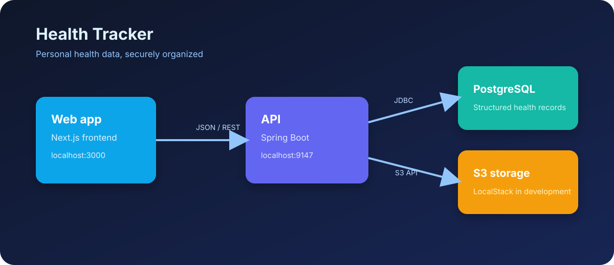
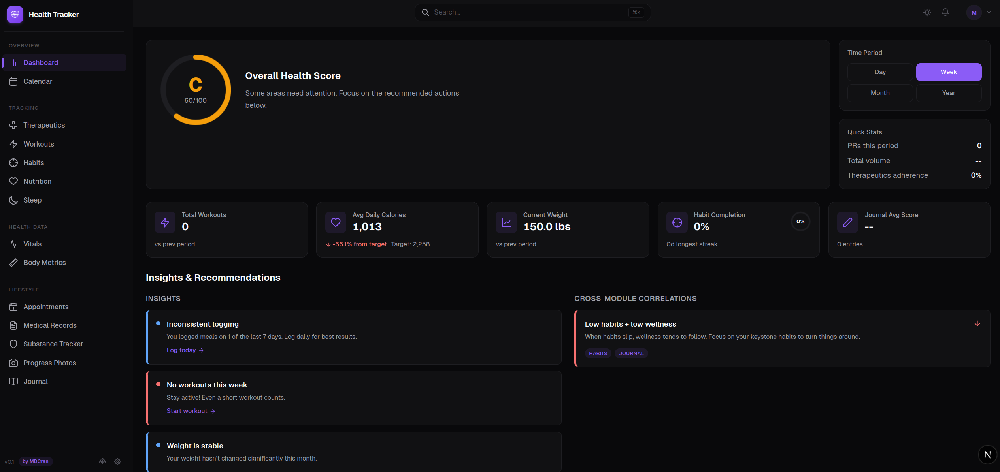
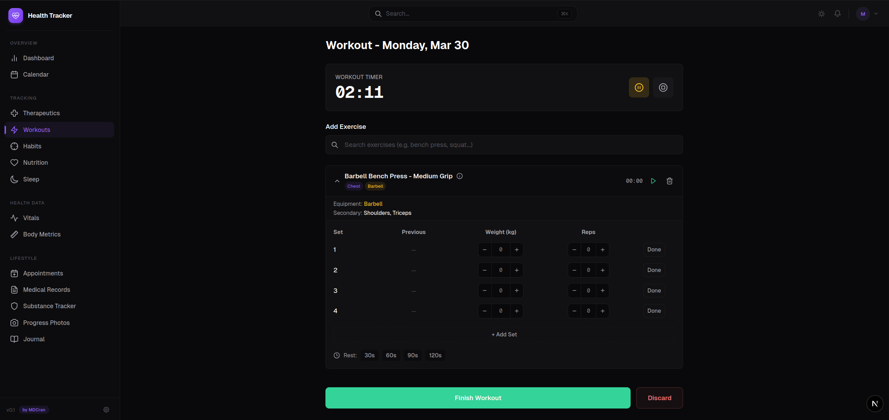
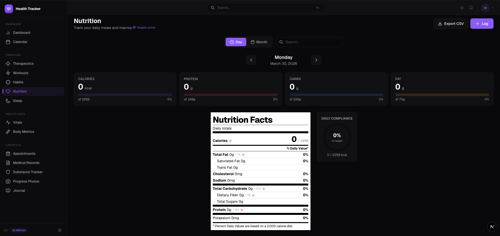

# Health Tracker

[](https://github.com/MDCran/health-tracker/actions/workflows/security-checks.yml) [](https://github.com/MDCran/health-tracker/actions/workflows/codeql.yml)

Personal health tracking platform with a Next.js frontend and a Spring Boot backend.



## App screenshots

These screenshots show the running Health Tracker experience across its core tracking workflows.

### Dashboard



### Workout tracking



### Nutrition tracking



## Quickstart

Requires Docker Desktop, JDK 21, and Node 20+.

**1. Start infrastructure (Postgres + LocalStack S3):**

```bash
docker compose up -d
```

Check both services are healthy:

```bash
docker compose ps
```

**2. Start the backend:**

```bash
cd backend
./mvnw spring-boot:run
```

Or open `backend/pom.xml` in IntelliJ and run `HealthApplication`. The server starts on port **9147**.

**3. Start the frontend:**

```bash
cd frontend
npm install
npm run dev
```

Open http://localhost:3000.

## Stopping

```bash
docker compose down       # stop services, keep data
docker compose down -v    # stop and wipe data (resets DB + S3)
```

## Services

| Service     | Port | Notes |
|-------------|------|-------|
| Postgres    | 5433 | `postgres:16`, init from `docker/postgres/init.sql` on first boot only |
| LocalStack  | 4566 | S3 only; persistent volume `localstack_data` |
| Backend     | 9147 | Spring Boot, JDK 21 |
| Frontend    | 3000 | Next.js |

The S3 bucket (`health-tracker`) is auto-created by the backend on startup via `S3StorageService.ensureBucketExists()`.

## Useful commands

Inspect the S3 bucket (requires `aws` CLI):

```bash
aws --endpoint-url=http://localhost:4566 s3 ls s3://health-tracker --recursive
```

Talk to Postgres:

```bash
docker compose exec postgres psql -U health_user -d personal_health
```

## Production deployment

See `docs/DEPLOYMENT_DIGITAL_OCEAN.md` for the playbook to migrate from LocalStack to DigitalOcean Spaces + Managed Postgres + App Platform.
